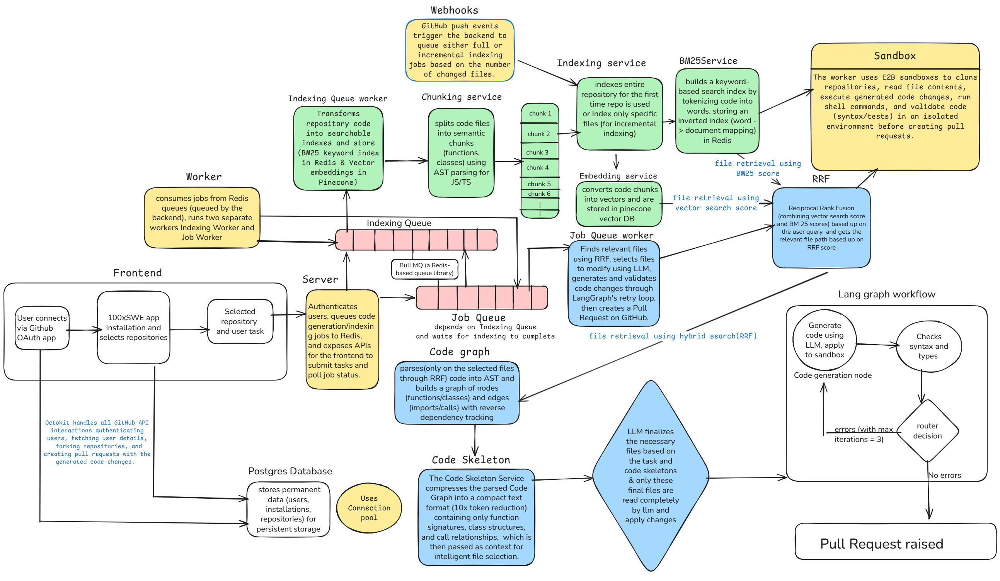

# 100xSWE



### AI-Powered Software Engineering Agent

An intelligent autonomous agent that understands your codebase, identifies relevant files, and generates code changes automatically using hybrid search (BM25 + Vector embeddings) and AST-based code analysis.

[](https://github.com)

---

## Table of Contents

- [Overview](#overview)
- [Key Features](#key-features)
- [Architecture](#architecture)
- [Tech Stack](#tech-stack)
- [Project Structure](#project-structure)
- [Prerequisites](#prerequisites)
- [Installation](#installation)
- [Configuration](#configuration)
- [Usage](#usage)
- [API Endpoints](#api-endpoints)
- [How It Works](#how-it-works)
- [Development](#development)

---

## Overview

100xSWE is an autonomous software engineering agent that combines advanced AI techniques to understand and modify codebases intelligently. It uses a sophisticated pipeline that includes:

- **Hybrid Search**: Combining BM25 (keyword-based) and vector embeddings (semantic) for optimal code retrieval
- **AST Analysis**: Understanding code structure and dependencies using Abstract Syntax Trees
- **Code Graph**: Building dependency graphs to identify all relevant files
- **LangGraph Orchestration**: Managing complex multi-step code generation workflows
- **Sandbox Execution**: Validating generated code in isolated environments

---

## Key Features

### Intelligent Code Understanding
- **Smart Chunking**: Analyzes code at function and class level for precise context
- **Hybrid Search**: Reciprocal Rank Fusion (RRF) combines BM25 and vector search results
- **Dependency Analysis**: AST-based code graph to find all dependent files
- **Context-Aware**: Understands relationships between different parts of the codebase

### Automated Code Generation
- **Task-Based Generation**: Provide a natural language task, get code changes
- **Multi-File Edits**: Handles changes across multiple related files
- **Code Validation**: Validates syntax and runs tests in sandboxed environments
- **PR Creation**: Automatically creates pull requests with generated changes

### Scalable Architecture
- **Queue-Based Processing**: BullMQ for reliable job processing
- **Redis Caching**: Fast BM25 index storage and retrieval
- **Pinecone Vector DB**: Efficient semantic search at scale
- **Worker Architecture**: Separate indexing and generation workers

---

## Architecture

The system follows a multi-stage pipeline:

1. **Repository Indexing**
   - Clone GitHub repository
   - Chunk code by functions/classes
   - Generate vector embeddings (stored in Pinecone)
   - Build BM25 index (stored in Redis)

2. **Query Processing**
   - Parse user task/query
   - Hybrid search: BM25 + Vector search
   - RRF ranking to combine results
   - Return top candidate files

3. **Code Analysis**
   - Build AST and code graph
   - Find dependent files
   - Extract context (imports, function signatures, etc.)

4. **Code Generation**
   - LLM analyzes context and task
   - Generate code changes
   - Validate in sandbox (E2B Code Interpreter)
   - Create pull request

---

## Tech Stack

### Frontend
- **Next.js 16** - React framework with App Router
- **React 19** - Latest React with concurrent features
- **TypeScript** - Type-safe development
- **Tailwind CSS 4** - Utility-first styling

### Backend (Primary)
- **Bun** - Fast JavaScript runtime
- **Express** - Web framework
- **BullMQ** - Job queue management
- **Redis** - Caching and BM25 storage
- **TypeScript** - Type safety

### Worker
- **Bun** - Runtime environment
- **LangChain & LangGraph** - AI orchestration
- **Pinecone** - Vector database
- **Redis/BullMQ** - Job processing
- **Octokit** - GitHub API integration
- **Babel Parser & Traverse** - AST parsing
- **AI SDKs**: Google Gemini, OpenAI
- **E2B Code Interpreter** - Sandbox execution
- **Daytona SDK** - Development environments

---

## Project Structure

```
Humanish/
├── frontend/                 # Next.js frontend application
│   ├── app/                 # Next.js App Router pages
│   ├── public/              # Static assets
│   │   └── humanish.png     # Architecture diagram
│   ├── package.json
│   └── tsconfig.json
│
├── primary_backend/         # Main API server
│   ├── src/
│   │   ├── config/         # Queue configurations
│   │   └── server.ts       # Express server
│   ├── package.json
│   └── tsconfig.json
│
└── worker/                  # Background job processor
    ├── src/
    │   ├── config/         # Queue and AI configurations
    │   ├── lib/            # Utilities and helpers
    │   ├── processors/     # Job processors
    │   │   ├── indexing.processor.ts
    │   │   └── job.processor.ts
    │   ├── services/       # Core business logic
    │   │   ├── ai.service.ts
    │   │   ├── bm25.service.ts
    │   │   ├── chunking.service.ts
    │   │   ├── code_graph.service.ts
    │   │   ├── embedding.service.ts
    │   │   ├── git.service.ts
    │   │   ├── github.service.ts
    │   │   ├── hybrid-search.service.ts
    │   │   ├── repository.service.ts
    │   │   ├── sandbox.service.ts
    │   │   └── vectordb.service.ts
    │   ├── workflows/      # LangGraph workflows
    │   ├── types/          # TypeScript type definitions
    │   └── worker.ts       # Worker entry point
    ├── package.json
    └── tsconfig.json
```

---

## Prerequisites

- **Node.js** 18+ or **Bun** runtime
- **Redis** instance
- **Pinecone** account (vector database)
- **GitHub** account with personal access token
- **OpenAI** or **Google AI** API key
- **E2B** account (for code execution sandboxes)

---

## Installation

### 1. Clone the repository

```bash
git clone https://github.com/yourusername/Humanish.git
cd Humanish
```

### 2. Install dependencies

#### Frontend
```bash
cd frontend
npm install
# or
bun install
```

#### Primary Backend
```bash
cd primary_backend
bun install
```

#### Worker
```bash
cd worker
bun install
```

---

## Configuration

### Environment Variables

Create `.env` files in each service directory:

#### Primary Backend (`.env`)
```env
PORT=3000
REDIS_HOST=localhost
REDIS_PORT=6379
REDIS_PASSWORD=your_redis_password
FRONTEND_URL=http://localhost:3001
```

#### Worker (`.env`)
```env
# Redis
REDIS_HOST=localhost
REDIS_PORT=6379
REDIS_PASSWORD=your_redis_password

# GitHub
GITHUB_ACCESS_TOKEN=your_github_token

# AI Providers
OPENAI_API_KEY=your_openai_key
GOOGLE_API_KEY=your_google_ai_key

# Pinecone
PINECONE_API_KEY=your_pinecone_key
PINECONE_INDEX=humanish-index
PINECONE_ENVIRONMENT=your-environment

# E2B Sandbox
E2B_API_KEY=your_e2b_key

# Daytona (optional)
DAYTONA_API_KEY=your_daytona_key
```

#### Frontend (`.env.local`)
```env
NEXT_PUBLIC_API_URL=http://localhost:3000
```

---

## Usage

### Start Services

#### 1. Start Redis
```bash
redis-server
```

#### 2. Start Primary Backend
```bash
cd primary_backend
bun run dev
```

Server will start on `http://localhost:3000`

#### 3. Start Worker
```bash
cd worker
bun run dev
```

#### 4. Start Frontend
```bash
cd frontend
npm run dev
# or
bun run dev
```

Frontend will start on `http://localhost:3001`

### Using the API

#### Index a Repository
```bash
curl -X POST http://localhost:3000/api/chat \
  -H "Content-Type: application/json" \
  -d '{
    "repoUrl": "https://github.com/owner/repo",
    "task": "Add error handling to the authentication module"
  }'
```

#### Check Job Status
```bash
curl http://localhost:3000/api/status/{jobId}
```

---

## API Endpoints

### POST `/api/chat`
Submit a code generation task

**Request Body:**
```json
{
  "repoUrl": "https://github.com/owner/repo",
  "task": "Your task description"
}
```

**Response:**
```json
{
  "message": "Task queued",
  "indexing": false,
  "jobId": "123",
  "repoId": "owner/repo",
  "statusUrl": "/api/status/123"
}
```

### GET `/api/status/:jobId`
Check job status and get results

**Response:**
```json
{
  "jobId": "123",
  "state": "completed",
  "progress": 100,
  "result": {
    "prUrl": "https://github.com/owner/repo/pull/456",
    "filesChanged": ["src/auth.ts", "src/utils.ts"],
    "summary": "Added error handling..."
  }
}
```

### GET `/health`
Health check endpoint

---

## How It Works

### 1. Repository Indexing
When a new repository is provided:
- Clones the repository from GitHub
- Chunks code intelligently (functions, classes, modules)
- Generates embeddings using OpenAI/Google AI
- Stores embeddings in Pinecone
- Builds BM25 index and stores in Redis

### 2. Query Processing
When a task is submitted:
- Generates query embedding
- Performs vector search in Pinecone
- Performs BM25 keyword search in Redis
- Combines results using Reciprocal Rank Fusion (RRF)
- Returns top N most relevant code chunks

### 3. Code Analysis
For candidate files:
- Parses code into AST using Babel
- Builds code graph showing dependencies
- Identifies all files that need to be modified
- Extracts context (imports, types, signatures)

### 4. Code Generation
With full context:
- LLM generates code changes
- Validates syntax and structure
- Tests in E2B sandbox environment
- Creates commit and pull request
- Returns PR URL to user

### Hybrid Search Algorithm

The system uses **Reciprocal Rank Fusion (RRF)** to combine BM25 and vector search:

```
RRF_score = Σ(1 / (k + rank_i))
```

Where:
- `k = 60` (RRF constant)
- `rank_i` is the rank from each search method
- Higher scores indicate better matches

---

## Development

### Running Tests
```bash
# Worker tests
cd worker
bun test

# Backend tests
cd primary_backend
bun test

# Frontend tests
cd frontend
npm test
```

### Building for Production

```bash
# Frontend
cd frontend
npm run build

# Backend
cd primary_backend
bun run build

# Worker
cd worker
bun run build
```

### Code Quality
```bash
# Linting
npm run lint

# Type checking
tsc --noEmit
```

